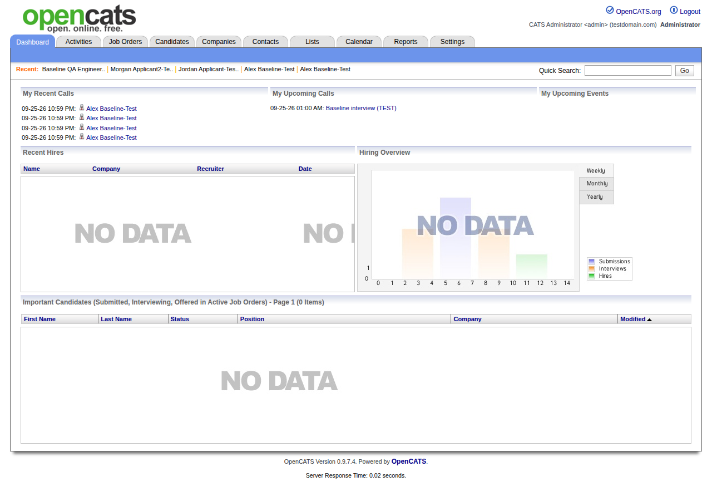
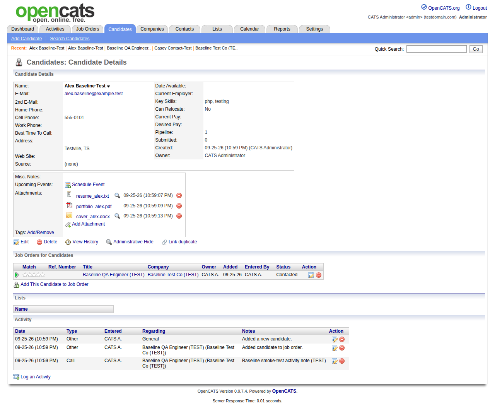
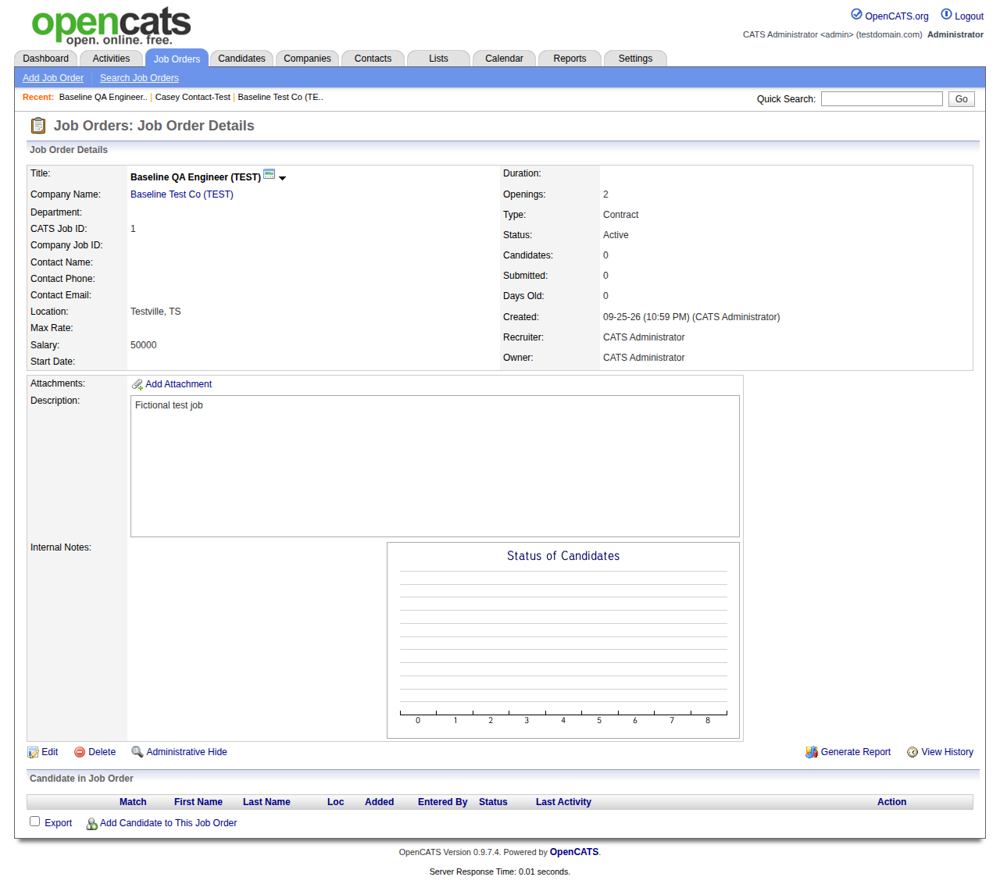
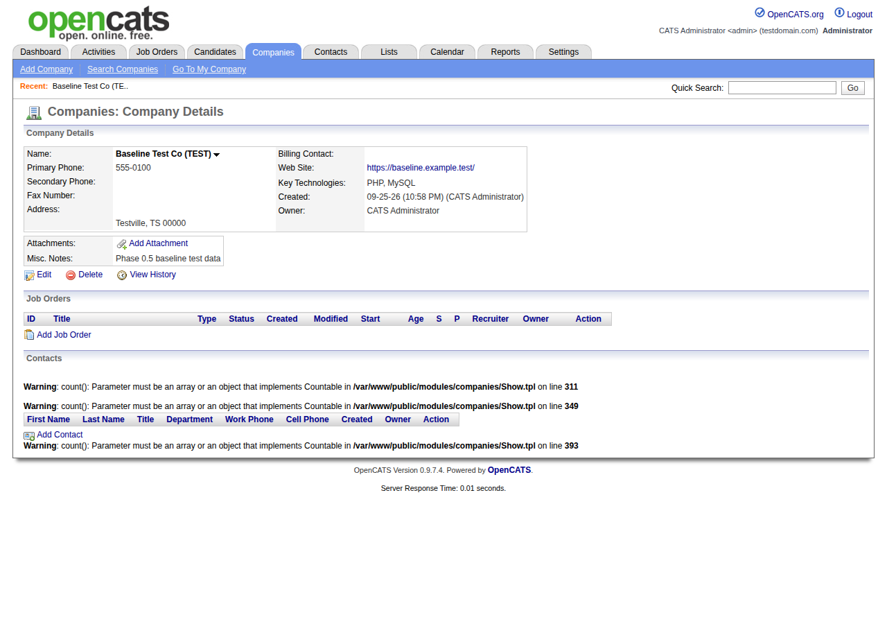
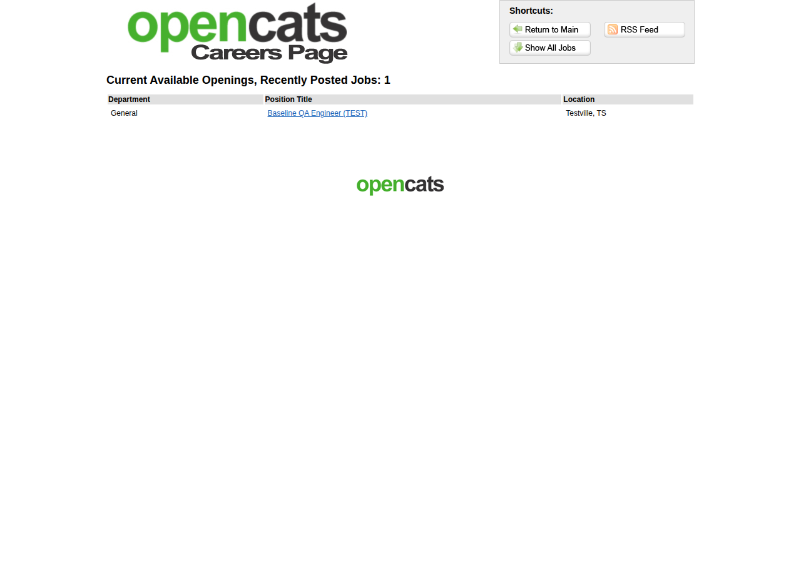
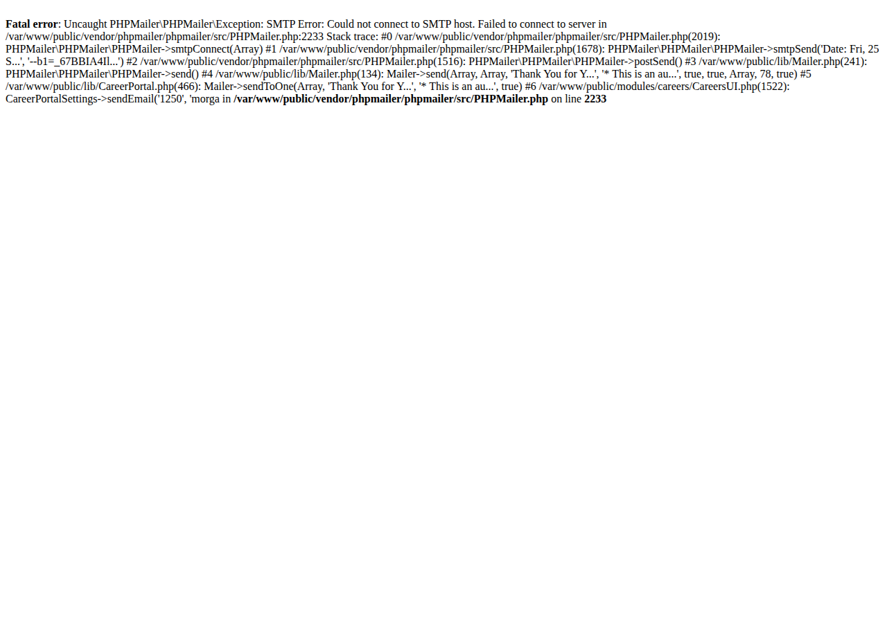
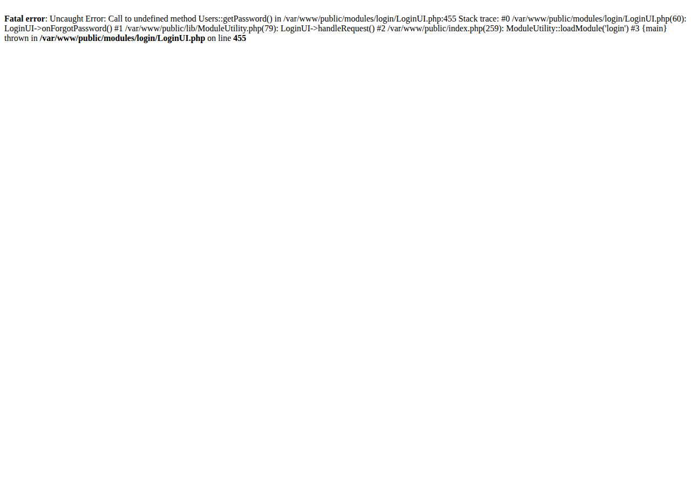
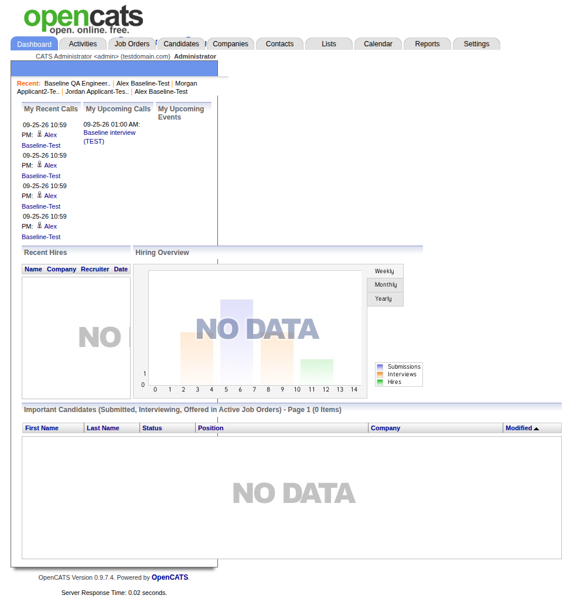

# Current System Screenshots — OpenCATS baseline (Phase 0.5)

Full-page screenshots of the **current, unmodified** application, captured by the smoke test on 2026-09-25 (final run 22:58–23:00 UTC) with headless Chromium 141 at 1280×900 (and 390×844 where noted). All data shown is fictional test data. Files are in `screenshots/`; numbers match the step numbers in `SMOKE_TEST.md` and `evidence/final-run/results.json`.

## Highlights

| | |
|---|---|
| **Dashboard (with test data)** — #90 | **Candidate detail** — #32 |
|  |  |
| **Job order detail** — #20 | **Company detail with PHP warnings (RT-06)** — #11 |
|  |  |
| **Careers: job list** — #81 | **Careers: application result shown to the applicant (RT-04)** — #86 |
|  |  |
| **Forgot password (RT-03)** — #04 | **Dashboard at 390 px (RT-14)** — S4 |
|  |  |

## All screenshots (final run)

| # | Feature | Step | URL after step | File | Observation |
|---|---|---|---|---|---|
| 01 | 01 Login | login page renders | `/index.php` | [01-01-login-login-page-renders.png](screenshots/01-01-login-login-page-renders.png) |  |
| 02 | 01 Login | invalid password rejected | `/index.php?m=login&a=attemptLogin` | [02-01-login-invalid-password-rejected.png](screenshots/02-01-login-invalid-password-rejected.png) |  |
| 03 | 15 Email | forgot-password page (logged out) | `/index.php?m=login&a=forgotPassword` | [03-15-email-forgot-password-page-logged-out.png](screenshots/03-15-email-forgot-password-page-logged-out.png) | 2 missing images (RT-13) |
| 04 | 15 Email | forgot-password submit for admin | `/index.php?m=login&a=forgotPassword` | [04-15-email-forgot-password-submit-for-admin.png](screenshots/04-15-email-forgot-password-submit-for-admin.png) | PHP fatal Users::getPassword() (RT-03) |
| 05 | 01 Login | login as admin/admin | `/index.php?m=home` | [05-01-login-login-as-admin-admin.png](screenshots/05-01-login-login-as-admin-admin.png) |  |
| 06 | 02 Dashboard | home dashboard | `/index.php?m=home` | [06-02-dashboard-home-dashboard.png](screenshots/06-02-dashboard-home-dashboard.png) |  |
| 07 | 02 Dashboard | Activities tab | `/index.php?m=activity` | [07-02-dashboard-activities-tab.png](screenshots/07-02-dashboard-activities-tab.png) |  |
| 08 | 02 Dashboard | Lists tab | `/index.php?m=lists` | [08-02-dashboard-lists-tab.png](screenshots/08-02-dashboard-lists-tab.png) |  |
| 09 | 06 Companies | companies list | `/index.php?m=companies` | [09-06-companies-companies-list.png](screenshots/09-06-companies-companies-list.png) |  |
| 10 | 06 Companies | add company (form submit) | `/index.php?m=companies&a=show&companyID=2` | [10-06-companies-add-company-form-submit.png](screenshots/10-06-companies-add-company-form-submit.png) | 3 PHP warnings on page (RT-06) |
| 11 | 06 Companies | company detail | `/index.php?m=companies&a=show&companyID=2` | [11-06-companies-company-detail.png](screenshots/11-06-companies-company-detail.png) | 3 PHP warnings on page (RT-06) |
| 12 | 06 Companies | edit company page | `/index.php?m=companies&a=edit&companyID=2` | [12-06-companies-edit-company-page.png](screenshots/12-06-companies-edit-company-page.png) |  |
| 13 | 07 Contacts | contacts list | `/index.php?m=contacts` | [13-07-contacts-contacts-list.png](screenshots/13-07-contacts-contacts-list.png) |  |
| 14 | 07 Contacts | add contact with company autocomplete | `/index.php?m=contacts&a=show&contactID=1` | [14-07-contacts-add-contact-with-company-autocomplete.png](screenshots/14-07-contacts-add-contact-with-company-autocomplete.png) |  |
| 15 | 07 Contacts | contact detail | `/index.php?m=contacts&a=show&contactID=1` | [15-07-contacts-contact-detail.png](screenshots/15-07-contacts-contact-detail.png) |  |
| 16 | 07 Contacts | cold call list | `/index.php?m=contacts&a=showColdCallList` | [16-07-contacts-cold-call-list.png](screenshots/16-07-contacts-cold-call-list.png) |  |
| 17 | 05 Jobs | job orders list | `/index.php?m=joborders` | [17-05-jobs-job-orders-list.png](screenshots/17-05-jobs-job-orders-list.png) |  |
| 18 | 05 Jobs | Add Job Order popup | `/index.php?m=joborders` | [18-05-jobs-add-job-order-popup.png](screenshots/18-05-jobs-add-job-order-popup.png) |  |
| 19 | 05 Jobs | add job order (public) | `/index.php?m=joborders&a=show&jobOrderID=1` | [19-05-jobs-add-job-order-public.png](screenshots/19-05-jobs-add-job-order-public.png) | CKEditor licence error in console (RT-07) |
| 20 | 05 Jobs | job order detail | `/index.php?m=joborders&a=show&jobOrderID=1` | [20-05-jobs-job-order-detail.png](screenshots/20-05-jobs-job-order-detail.png) |  |
| 21 | 03 Candidates | candidates list (before add) | `/index.php?m=candidates` | [21-03-candidates-candidates-list-before-add.png](screenshots/21-03-candidates-candidates-list-before-add.png) |  |
| 22 | 14 Resume | add-candidate: upload resume text file for parsing | `/index.php?m=candidates&a=add` | [22-14-resume-add-candidate-upload-resume-text-file-for-parsing.png](screenshots/22-14-resume-add-candidate-upload-resume-text-file-for-parsing.png) |  |
| 23 | 03 Candidates | add candidate (form submit) | `/index.php?m=candidates&a=show&candidateID=2` | [23-03-candidates-add-candidate-form-submit.png](screenshots/23-03-candidates-add-candidate-form-submit.png) |  |
| 24 | 03 Candidates | add duplicate candidate (same name/email) | `/index.php?m=candidates&a=show&candidateID=3` | [24-03-candidates-add-duplicate-candidate-same-name-email.png](screenshots/24-03-candidates-add-duplicate-candidate-same-name-email.png) | duplicate notice shown |
| 25 | 03 Candidates | candidates list (after add) | `/index.php?m=candidates` | [25-03-candidates-candidates-list-after-add.png](screenshots/25-03-candidates-candidates-list-after-add.png) |  |
| 26 | 04 Candidate detail | candidate detail page | `/index.php?m=candidates&a=show&candidateID=2` | [26-04-candidate-detail-candidate-detail-page.png](screenshots/26-04-candidate-detail-candidate-detail-page.png) |  |
| 27 | 14 Resume | upload PDF attachment via popup | `/index.php?m=candidates&a=show&candidateID=2` | [27-14-resume-upload-pdf-attachment-via-popup.png](screenshots/27-14-resume-upload-pdf-attachment-via-popup.png) | "unable to index" message for PDF (RT-08) |
| 28 | 14 Resume | upload DOCX attachment via popup | `/index.php?m=candidates&a=show&candidateID=2` | [28-14-resume-upload-docx-attachment-via-popup.png](screenshots/28-14-resume-upload-docx-attachment-via-popup.png) |  |
| 29 | 14 Resume | download attachments (integrity check) | `/index.php?m=candidates&a=show&candidateID=2` | [29-14-resume-download-attachments-integrity-check.png](screenshots/29-14-resume-download-attachments-integrity-check.png) |  |
| 30 | 04 Candidate detail | add candidate to job pipeline (popup search) | `/index.php?m=candidates&a=show&candidateID=2` | [30-04-candidate-detail-add-candidate-to-job-pipeline-popup-sear.png](screenshots/30-04-candidate-detail-add-candidate-to-job-pipeline-popup-sear.png) |  |
| 31 | 15 Email | pipeline status change + activity (may trigger candidate e-mail) | `/index.php?m=candidates&a=show&candidateID=2` | [31-15-email-pipeline-status-change-activity-may-trigger-candida.png](screenshots/31-15-email-pipeline-status-change-activity-may-trigger-candida.png) |  |
| 32 | 04 Candidate detail | candidate detail after pipeline/activity | `/index.php?m=candidates&a=show&candidateID=2` | [32-04-candidate-detail-candidate-detail-after-pipeline-activity.png](screenshots/32-04-candidate-detail-candidate-detail-after-pipeline-activity.png) |  |
| 33 | 04 Candidate detail | edit candidate + save | `/index.php?m=candidates&a=show&candidateID=2` | [33-04-candidate-detail-edit-candidate-save.png](screenshots/33-04-candidate-detail-edit-candidate-save.png) |  |
| 34 | 14 Resume | view resume text page | `/index.php?m=candidates&a=viewResume&attachmentID=1` | [34-14-resume-view-resume-text-page.png](screenshots/34-14-resume-view-resume-text-page.png) |  |
| 35 | 08 Calendar | calendar month view | `/index.php?m=calendar` | [35-08-calendar-calendar-month-view.png](screenshots/35-08-calendar-calendar-month-view.png) |  |
| 36 | 08 Calendar | add calendar event | `/index.php?m=calendar&view=MONTHVIEW&month=9&year=2026&week=-1&day=-1&` | [36-08-calendar-add-calendar-event.png](screenshots/36-08-calendar-add-calendar-event.png) |  |
| 37 | 08 Calendar | upcoming events | `/index.php?m=calendar&view=MONTHVIEW&month=9&year=2026&week=-1&day=-1&` | [37-08-calendar-upcoming-events.png](screenshots/37-08-calendar-upcoming-events.png) |  |
| 38 | 09 Search | quick search (header) | `/index.php?m=home&a=quickSearch&quickSearchFor=Baseline&quickSearch=Go` | [38-09-search-quick-search-header.png](screenshots/38-09-search-quick-search-header.png) |  |
| 39 | 09 Search | candidate search by name | `/index.php?m=candidates&a=search&getback=getback&mode=searchByFullName` | [39-09-search-candidate-search-by-name.png](screenshots/39-09-search-candidate-search-by-name.png) |  |
| 40 | 09 Search | candidate search by key skills | `/index.php?m=candidates&a=search&getback=getback&mode=searchByKeySkill` | [40-09-search-candidate-search-by-key-skills.png](screenshots/40-09-search-candidate-search-by-key-skills.png) |  |
| 41 | 09 Search | candidate search by city | `/index.php?m=candidates&a=search&getback=getback&mode=searchByCity&wil` | [41-09-search-candidate-search-by-city.png](screenshots/41-09-search-candidate-search-by-city.png) |  |
| 42 | 14 Resume | resume keyword search: TXT resume (Zyxwvutronics) | `/index.php?m=candidates&a=search&getback=getback&mode=searchByResume&w` | [42-14-resume-resume-keyword-search-txt-resume-zyxwvutronics.png](screenshots/42-14-resume-resume-keyword-search-txt-resume-zyxwvutronics.png) |  |
| 43 | 14 Resume | resume keyword search: PDF attachment (Quokkaflux) | `/index.php?m=candidates&a=search&getback=getback&mode=searchByResume&w` | [43-14-resume-resume-keyword-search-pdf-attachment-quokkaflux.png](screenshots/43-14-resume-resume-keyword-search-pdf-attachment-quokkaflux.png) | no result: PDF text not indexed (RT-08) |
| 44 | 14 Resume | resume keyword search: DOCX attachment (Pangolinware) | `/index.php?m=candidates&a=search&getback=getback&mode=searchByResume&w` | [44-14-resume-resume-keyword-search-docx-attachment-pangolinware.png](screenshots/44-14-resume-resume-keyword-search-docx-attachment-pangolinware.png) |  |
| 45 | 14 Resume | resume keyword search: negative control (term not in any document) | `/index.php?m=candidates&a=search&getback=getback&mode=searchByResume&w` | [45-14-resume-resume-keyword-search-negative-control-term-not-in.png](screenshots/45-14-resume-resume-keyword-search-negative-control-term-not-in.png) | negative control: no result (expected) |
| 46 | 09 Search | job order search | `/index.php?m=joborders&a=search&getback=getback&mode=searchByJobTitle&` | [46-09-search-job-order-search.png](screenshots/46-09-search-job-order-search.png) |  |
| 47 | 09 Search | company search | `/index.php?m=companies&a=search&getback=getback&mode=searchByName&wild` | [47-09-search-company-search.png](screenshots/47-09-search-company-search.png) |  |
| 48 | 09 Search | contact search | `/index.php?m=contacts&a=search&getback=getback&mode=searchByFullName&w` | [48-09-search-contact-search.png](screenshots/48-09-search-contact-search.png) |  |
| 49 | 10 Reports | reports tab | `/index.php?m=reports` | [49-10-reports-reports-tab.png](screenshots/49-10-reports-reports-tab.png) |  |
| 50 | 10 Reports | submission report (to date) | `/index.php?m=reports&a=showSubmissionReport&period=toDate` | [50-10-reports-submission-report-to-date.png](screenshots/50-10-reports-submission-report-to-date.png) |  |
| 51 | 10 Reports | placement report (to date) | `/index.php?m=reports&a=showPlacementReport&period=toDate` | [51-10-reports-placement-report-to-date.png](screenshots/51-10-reports-placement-report-to-date.png) |  |
| 52 | 10 Reports | EEO report customize + preview | `/index.php?m=reports&a=generateEEOReportPreview&period=all&status=all&` | [52-10-reports-eeo-report-customize-preview.png](screenshots/52-10-reports-eeo-report-customize-preview.png) | 2 JS errors (RT-10) |
| 53 | 10 Reports | job order report customize page | `/index.php?m=reports&a=customizeJobOrderReport&jobOrderID=1` | [53-10-reports-job-order-report-customize-page.png](screenshots/53-10-reports-job-order-report-customize-page.png) |  |
| 54 | 10 Reports | job order report PDF generation | `/index.php?m=reports&a=customizeJobOrderReport&jobOrderID=1` | — | no screenshot — HTTP response saved as evidence (RT-09) |
| 55 | 10 Reports | job order pipeline graph image | `/index.php?m=reports&a=customizeJobOrderReport&jobOrderID=1` | — | no screenshot — image checked via HTTP |
| 56 | 11 Settings | my profile | `/index.php?m=settings` | [56-11-settings-my-profile.png](screenshots/56-11-settings-my-profile.png) |  |
| 57 | 11 Settings | administration | `/index.php?m=settings&a=administration` | [57-11-settings-administration.png](screenshots/57-11-settings-administration.png) |  |
| 58 | 11 Settings | change password page | `/index.php?m=settings&a=myProfile&s=changePassword` | [58-11-settings-change-password-page.png](screenshots/58-11-settings-change-password-page.png) |  |
| 59 | 11 Settings | site details | `/index.php?m=settings&a=administration&s=siteName` | [59-11-settings-site-details.png](screenshots/59-11-settings-site-details.png) |  |
| 60 | 11 Settings | user management | `/index.php?m=settings&a=manageUsers` | [60-11-settings-user-management.png](screenshots/60-11-settings-user-management.png) |  |
| 61 | 11 Settings | add user page | `/index.php?m=settings&a=addUser` | [61-11-settings-add-user-page.png](screenshots/61-11-settings-add-user-page.png) |  |
| 62 | 11 Settings | login activity | `/index.php?m=settings&a=loginActivity` | [62-11-settings-login-activity.png](screenshots/62-11-settings-login-activity.png) |  |
| 63 | 11 Settings | e-mail templates | `/index.php?m=settings&a=emailTemplates` | [63-11-settings-e-mail-templates.png](screenshots/63-11-settings-e-mail-templates.png) |  |
| 64 | 11 Settings | localization | `/index.php?m=settings&a=administration&s=localization` | [64-11-settings-localization.png](screenshots/64-11-settings-localization.png) |  |
| 65 | 11 Settings | site backup page | `/index.php?m=settings&a=createBackup` | [65-11-settings-site-backup-page.png](screenshots/65-11-settings-site-backup-page.png) |  |
| 66 | 11 Settings | EEO settings | `/index.php?m=settings&a=eeo` | [66-11-settings-eeo-settings.png](screenshots/66-11-settings-eeo-settings.png) |  |
| 67 | 11 Settings | tags | `/index.php?m=settings&a=tags` | [67-11-settings-tags.png](screenshots/67-11-settings-tags.png) |  |
| 68 | 11 Settings | customize calendar | `/index.php?m=settings&a=customizeCalendar` | [68-11-settings-customize-calendar.png](screenshots/68-11-settings-customize-calendar.png) |  |
| 69 | 11 Settings | extra fields | `/index.php?m=settings&a=customizeExtraFields` | [69-11-settings-extra-fields.png](screenshots/69-11-settings-extra-fields.png) |  |
| 70 | 11 Settings | passwords | `/index.php?m=settings&a=administration&s=passwords` | [70-11-settings-passwords.png](screenshots/70-11-settings-passwords.png) |  |
| 71 | 11 Settings | new version check page | `/index.php?m=settings&a=administration&s=newVersionCheck` | [71-11-settings-new-version-check-page.png](screenshots/71-11-settings-new-version-check-page.png) |  |
| 72 | 11 Settings | system information | `/index.php?m=settings&a=administration&s=systemInformation` | [72-11-settings-system-information.png](screenshots/72-11-settings-system-information.png) |  |
| 73 | 11 Settings | data import page | `/index.php?m=import` | [73-11-settings-data-import-page.png](screenshots/73-11-settings-data-import-page.png) |  |
| 74 | 11 Settings | add user (test recruiter) | `/index.php?m=settings&a=showUser&userID=1251` | [74-11-settings-add-user-test-recruiter.png](screenshots/74-11-settings-add-user-test-recruiter.png) |  |
| 75 | 12 Careers portal | enable careers website (Settings) | `/index.php?m=settings&a=careerPortalSettings` | [75-12-careers-portal-enable-careers-website-settings.png](screenshots/75-12-careers-portal-enable-careers-website-settings.png) | careers website enabled |
| 76 | 15 Email | e-mail settings page | `/index.php?m=settings&a=emailSettings` | [76-15-email-e-mail-settings-page.png](screenshots/76-15-email-e-mail-settings-page.png) |  |
| 77 | 15 Email | send test e-mail from settings (no SMTP server present) | `/index.php?m=settings&a=emailSettings` | [77-15-email-send-test-e-mail-from-settings-no-smtp-server-prese.png](screenshots/77-15-email-send-test-e-mail-from-settings-no-smtp-server-prese.png) | PHP fatal in result box (RT-04) |
| 78 | 15 Email | e-mail candidate from list (compose) | `/index.php?m=candidates&a=emailCandidates&i=candidates%3AcandidatesLis` | [78-15-email-e-mail-candidate-from-list-compose.png](screenshots/78-15-email-e-mail-candidate-from-list-compose.png) | PHP warning + CKEditor error (RT-11, RT-07) |
| 79 | 15 Email | e-mail candidate send | `/index.php?m=candidates&a=emailCandidates` | [79-15-email-e-mail-candidate-send.png](screenshots/79-15-email-e-mail-candidate-send.png) | PHP fatal (RT-04) |
| 80 | 12 Careers portal | careers home | `/careers/index.php` | [80-12-careers-portal-careers-home.png](screenshots/80-12-careers-portal-careers-home.png) |  |
| 81 | 12 Careers portal | careers: list all jobs | `/careers/index.php?p=showAll` | [81-12-careers-portal-careers-list-all-jobs.png](screenshots/81-12-careers-portal-careers-list-all-jobs.png) |  |
| 82 | 12 Careers portal | careers: job detail | `/careers/index.php?p=showJob&ID=1` | [82-12-careers-portal-careers-job-detail.png](screenshots/82-12-careers-portal-careers-job-detail.png) |  |
| 83 | 12 Careers portal | careers: search page | `/careers/index.php?p=search` | [83-12-careers-portal-careers-search-page.png](screenshots/83-12-careers-portal-careers-search-page.png) |  |
| 84 | 13 Candidate application | apply form | `/careers/index.php?m=careers&p=applyToJob&ID=1` | [84-13-candidate-application-apply-form.png](screenshots/84-13-candidate-application-apply-form.png) |  |
| 85 | 13 Candidate application | apply: file chosen, Upload NOT clicked, submit | `/careers/index.php?m=careers&p=onApplyToJobOrder` | [85-13-candidate-application-apply-file-chosen-upload-not-clicke.png](screenshots/85-13-candidate-application-apply-file-chosen-upload-not-clicke.png) | applicant sees PHP fatal; resume dropped (RT-04, RT-12) |
| 86 | 13 Candidate application | apply: Choose File -> Upload -> submit (DOCX) | `/careers/index.php?m=careers&p=onApplyToJobOrder` | [86-13-candidate-application-apply-choose-file-upload-submit-doc.png](screenshots/86-13-candidate-application-apply-choose-file-upload-submit-doc.png) | applicant sees PHP fatal; data saved (RT-04) |
| 87 | 13 Candidate application | applicants visible to recruiter (pipeline + attachments + resume search) | `/index.php?m=candidates&a=search&getback=getback&mode=searchByResume&w` | [87-13-candidate-application-applicants-visible-to-recruiter-pip.png](screenshots/87-13-candidate-application-applicants-visible-to-recruiter-pip.png) | final state: resume search finds the careers applicant |
| 88 | 12 Careers portal | RSS job feed | `/rss/` | [88-12-careers-portal-rss-job-feed.png](screenshots/88-12-careers-portal-rss-job-feed.png) | PHP fatal (RT-05) |
| 89 | 12 Careers portal | XML job feed | `/xml/` | [89-12-careers-portal-xml-job-feed.png](screenshots/89-12-careers-portal-xml-job-feed.png) |  |
| 90 | 02 Dashboard | home dashboard with test data | `/index.php?m=home` | [90-02-dashboard-home-dashboard-with-test-data.png](screenshots/90-02-dashboard-home-dashboard-with-test-data.png) |  |
| 91 | 02 Dashboard | Activities: all periods | `/index.php?m=activity&a=viewByDate&getback=getback&period=all` | [91-02-dashboard-activities-all-periods.png](screenshots/91-02-dashboard-activities-all-periods.png) |  |
| 92 | Layout | candidates list at 390px width | `/index.php?m=candidates` | [92-layout-candidates-list-at-390px-width.png](screenshots/92-layout-candidates-list-at-390px-width.png) | page 978 px wide at 390 px (RT-14) |
| 93 | Layout | careers job list at 390px width | `/careers/index.php?p=showAll` | [93-layout-careers-job-list-at-390px-width.png](screenshots/93-layout-careers-job-list-at-390px-width.png) | page 940 px wide at 390 px (RT-14) |
| 94 | 01 Login | logout | `/index.php?m=login` | [94-01-login-logout.png](screenshots/94-01-login-logout.png) |  |

Steps 54 and 55 returned non-HTML responses (PDF request, JPEG graph) and were checked over HTTP instead of screenshotted.

## Supplementary captures (`smoke/supplement.js`, after the final run)

| ID | What | File |
|---|---|---|
| S1 | Job order add form — CKEditor did not initialise (plain textarea) | [S1-job-order-add-form.png](screenshots/S1-job-order-add-form.png) |
| S2 | E-mail candidate compose page — 1325 px wide on a 1280 px viewport | [S2-email-candidate-compose.png](screenshots/S2-email-candidate-compose.png) |
| S3 | Careers apply form (before submit) | [S3-careers-apply-form.png](screenshots/S3-careers-apply-form.png) |
| S4 | Dashboard at 390 px — header overlap, horizontal scroll | [S4-dashboard-390px.png](screenshots/S4-dashboard-390px.png) |
| S5 | Candidate detail at 390 px | [S5-candidate-detail-390px.png](screenshots/S5-candidate-detail-390px.png) |
| S6 | Login page at 390 px (fits) | [S6-login-page-390px.png](screenshots/S6-login-page-390px.png) |

## Notes
- Screenshots show exactly what the browser rendered, including PHP warnings/fatal errors printed into pages (`display_errors=On` is the PHP image default).
- The "Recent:" bar at the top of recruiter pages reflects the order of the scripted run.
- Harness-debugging runs 1–2 produced additional screenshots that were not kept; they only differ where the test script was wrong (see `SMOKE_TEST.md` §3).
